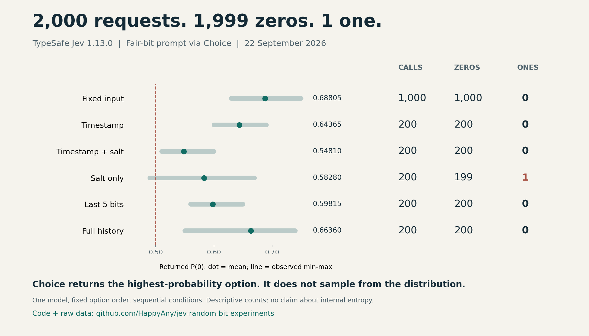

# Jev 随机比特实验

**最新追加（2026-09-23）：提示改为 `Choose 1 or 0`，选项也按 `1, 0` 排列，再测 200 次仍全部为 0。** P(0) 均值为 0.60980；全部实际请求正文已逐条核验。当前累计 **2,400 次，2,399 个 0、1 个 1**，覆盖 8 种条件、9 个采集批次。[提示与选项同时反转报告](docs/RANDOM_BITS_BOTH_ONE_FIRST.md) · [最新原始数据](followups/fixed-both-one-first-200/) · [离线核验脚本](verify_one_first.py)

上一轮只反转 criteria 顺序、提示仍为 `Choose 0 or 1`：200 次同样全为 0，P(0) 均值 0.68140。[仅选项反转报告](docs/RANDOM_BITS_ONE_FIRST.md) · [该轮原始数据](followups/fixed-one-first-200/)。两轮不同时段采集，均值差异不能单独用于确定因果。

以下是首轮 2,000 次的完整快照；表格、配图、`derived/summary.json` 和 `X_POST.md` 中的 2,000 次统计均对应首轮。追加试验单独保存，没有覆盖或重复计入原批次。

## 首轮：2,000 次请求，1,999 个 0、1 个 1

对 TypeSafe AI 的 `jev-1.13.0` 发出同一个要求：**独立、等概率地选择 0 或 1**。我们依次测试固定输入、时间戳、随机盐和两种历史反馈，共 6 种条件、7 个采集批次、2,000 次真实 API 请求。

**观察：这套 Choice 调用方式没有产生近似公平的随机比特。解释需要结合接口语义：官方定义的 `choice` 是最高概率选项，而不是按分布抽样。** 这是一项接口行为实验，不能据此推断 Jev 的内部随机机制、通用能力或分类质量。[官方 Choice 文档](https://docs.typesafe.ai/primitives/choice)



## 结果

采集日期：2026-09-22，Asia/Shanghai。所有比特请求实际响应模型均为 `jev-1.13.0`，全部 HTTP 200。

| 输入条件 | 请求数 | 返回 0 | 返回 1 | 返回 P(0) 均值 | P(0) 范围 |
|---|---:|---:|---:|---:|---:|
| 固定输入 | 1,000 | 1,000 | 0 | 0.68805 | 0.63–0.75 |
| 每次加入时间戳 | 200 | 200 | 0 | 0.64365 | 0.60–0.69 |
| 时间戳 + 随机盐 | 200 | 200 | 0 | 0.54810 | 0.51–0.60 |
| 仅随机盐 | 200 | 199 | 1 | 0.58280 | 0.49–0.67 |
| 最近五位历史 | 200 | 200 | 0 | 0.59815 | 0.56–0.65 |
| 全部历史 | 200 | 200 | 0 | 0.66360 | 0.55–0.74 |
| 描述性合计 | **2,000** | **1,999（99.95%）** | **1（0.05%）** | — | — |

固定输入的 1,000 次由最初 200 次和观察结果后追加的 800 次组成，没有把它们的合并文件重复计入。合计覆盖不同输入条件，只用于汇总数量，不视为一项预先设计的同分布试验。均值与范围来自服务返回的概率字段，**不等于实际输出频率**。

唯一的 `1` 出现在“仅随机盐”的第 168 次：`P(0)=0.49`、`P(1)=0.51`、`choice="1"`。[该批原始响应第 168 行](data/salt-200/raw.jsonl#L168)

另一条“仅随机盐”响应显示四舍五入后的 `0.50 / 0.50`，返回 `0`。全部 2,000 个 choice 都属于返回概率中的最大值选项；显示平局不能说明服务内部的精确概率或平局策略。

## 实验是怎么做的

每次请求一个 Choice，串行执行，选项始终按 `0`、`1` 排列，没有调换顺序。没有设置温度等未验证的参数。请求示例：

```json
{
  "model": "jev-1.13.0",
  "state": "No other information is provided.",
  "questions": {
    "bit": {
      "type": "choice",
      "instructions": "Generate one independent random bit. Choose 0 or 1 with equal probability, like a fair coin flip.",
      "criteria": {"0": null, "1": null}
    }
  }
}
```

- 时间戳组把每次实际时间写入 `state`，使用带时区的 ISO 8601 格式和微秒精度。
- 随机盐是每次新生成的 16 字节 `secrets.token_hex(16)`；各批 200 个盐互不重复。盐本身来自外部随机源。
- 两种历史组都从 `01010` 开始。滚动组追加输出并移除最旧一位；完整组保留初始五位和全部先前输出。初始五位不计入测试输出。
- 滚动组从第 5 次请求起输入 `00000`；完整组的请求历史从 5 位增长到 204 位，最后保存 205 位。两组反馈链都已逐条核验。
- 每批请求数在该批开始前固定。没有本地按返回概率抽样，没有自动重试或把失败请求替换成新样本。验证失败会停止并记录；本次所有批次完整成功。

## 结论与边界

这些输出明显不符合公平独立比特假设。例如，200 个输出全相同的精确双侧二项检验 p≈1.2446×10⁻⁶⁰；“仅随机盐”199:1 的 p≈2.5017×10⁻⁵⁸。各原始批次的诊断见 [机器可读汇总](derived/summary.json)。p 值不是“模型随机的概率”。

解释时应保留以下边界：

1. Choice 的官方行为就是选择最大概率选项；本试验没有发现该规则被违背，也没有证明接口存在缺陷。返回概率与按概率随机采样是不同操作。[接口说明](https://docs.typesafe.ai/primitives/choice)
2. 首轮测试只覆盖一个模型版本、一个问题措辞、固定选项顺序。随后增加了[选项反转对照](docs/RANDOM_BITS_ONE_FIRST.md)；标签替换、多个提示或多个初始历史尚未覆盖。
3. 后续条件是在看到前面结果后逐步提出的；批次在不同时间顺序运行，没有随机交错，不能把概率均值差异直接解释为输入变化的因果效应。
4. 重复输入下返回的概率也会变化，因此不能从 choice 长时间相同推出内部计算完全确定，也没有证据把现象归因于缓存。
5. 单纯接近 50/50 不能证明随机：固定交替的 `010101…` 也满足这一比例。有限样本不能认证物理随机性、不可预测性或密码学安全。

## 另外做过的基础功能试验

在比特试验前，还提交了 6 条虚构客服工单（5 条中文、1 条英文），每条包含 Choice、Score、Noul 共 4 个问题。6/6 部门分类符合预设预期，24 个答案通过结构检查，17 项预设语义检查通过。端到端耗时中位数约 405 ms，包含网络时间。[详细记录](docs/SMOKE_TEST.md) · [原始数据](data/smoke.json)

这 6 次调用不计入 2,000 次比特请求。样例由 Agent 编写，没有随机抽样或独立标注；不能据此宣称总体准确率、概率校准效果或提示注入安全性。

## 本地复核，不需要 API key

Python 3.10+；离线复核和统计仅使用标准库。

```bash
git clone https://github.com/HappyAny/jev-random-bit-experiments.git
cd jev-random-bit-experiments
python -B verify_dataset.py
python -B verify_one_first.py
python -B verify_one_first.py --prompt-one-first
python -B -m unittest -v test_analyze_bits.py
python -B analyze_bits.py data/salt-200/bits.txt
```

`verify_dataset.py` 核对 2,000 条响应、CSV、比特文件、选项顺序、实际 state、历史反馈、盐/时间戳唯一性、token 合计和来源哈希，并重新计算汇总。固定输入批次通过各自 `request.json` 还原共同请求，其余批次逐条保存实际请求。

## 重新调用 API

```bash
python -m pip install -r requirements.txt
python -B jev_random_bits.py --n 200
python -B jev_random_bits.py --timestamp --n 200
python -B jev_random_bits.py --timestamp --salt --n 200
python -B jev_random_bits.py --salt --n 200
python -B jev_random_bits.py --history --initial-history 01010 --n 200
python -B jev_random_bits.py --history-all --initial-history 01010 --n 200
```

API key 从 `TYPESAFE_API_KEY` 环境变量或隐藏输入读取。加 `--dry-run` 可只查看请求。实际调用会产生供应商用量，新结果写入被 Git 忽略的 `results/`，不会覆盖随仓库发布的数据。新的盐和时间戳不同，服务也可能变化，不承诺未来逐值复现。

## 文件与来源

- [data/catalog.json](data/catalog.json)：7 个原始比特批次及计数规则。
- [data/provenance.json](data/provenance.json)：原文件与公开副本的 SHA-256、路径及转换说明。响应、CSV、比特序列和请求定义保持逐字节一致；只替换派生 JSON 中的本机路径及文档链接。
- [derived/summary.json](derived/summary.json)：可离线重算的逐条件汇总及逐批次统计。
- [docs/](docs/)：各轮报告的公开副本；历史报告保留当时的解释范围，当前汇总以本 README 为准。
- [X_POST.md](X_POST.md)：中文推文草稿。
- [render_results.py](render_results.py)：基于汇总绘制 PNG/SVG；另需 `matplotlib`。

所有输入都是本次试验构造的数据；发布包不含 API key、认证头或本机绝对路径。原始本地记录保留。本项目未使用供应商背书，也不代表供应商观点。

官方资料于 2026-09-22 核对：[Choice 语义](https://docs.typesafe.ai/primitives/choice)、[模型版本与计费](https://docs.typesafe.ai/models)。比特试验共报告 693,608 输入 token、62,000 输出 token；按当日每百万输入 token 0.042 美元、输出免费估算约 **0.02913 美元**，不含基础功能试验，未核对实扣账单。

## English abstract

We made 2,000 real calls to TypeSafe AI's `jev-1.13.0`, requesting an independent fair bit via Choice across six input conditions. The observed choices were 1,999 zeros and one one. All reported choices were maximal-probability options, consistent with the documented Choice contract. This is an API behavior experiment, not an evaluation of internal entropy or general model quality. Raw observations, request definitions, code and an offline verifier are included. Conditions were selected sequentially, option order was fixed, and the initial history was `01010` for both history experiments.
